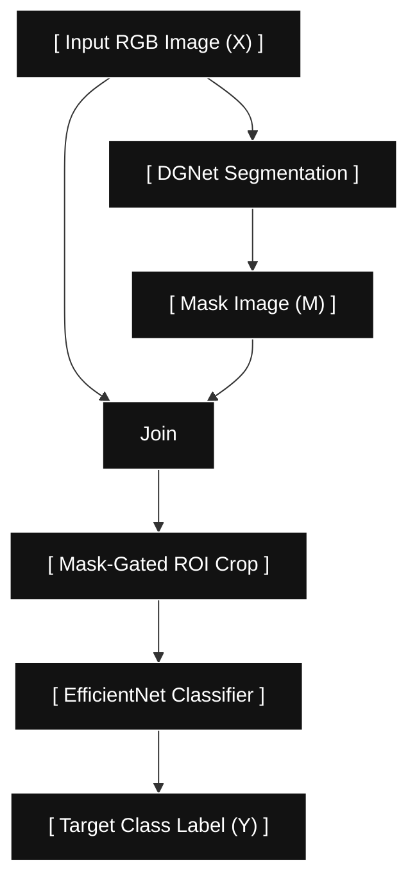

# Stage 2: Tactical Mask-Gated Target Classifier

## Aim & Objective

The primary aim of **Stage 2** is to verify and classify whether a candidate surveillance region contains a camouflaged entity or non-target noise.

Instead of processing the raw frame directly, Stage 2 takes the original **Input RGB Image ($X$)** alongside the spatial **Mask Image ($M$)** produced by Stage 1 (DGNet Segmentation). By masking and cropping tightly around the isolated Region of Interest (ROI), Stage 2 removes surrounding foliage and terrain noise to accurately predict whether a camouflaged target is present and identify its specific target category ($Y$).

---

## Data Flow Diagram (Mermaid)

---

## Technical Details

### 1. Mathematical Formulation

* **Mask-Gated Multiplication:**

$$X_{\text{Gated}} = X_{\text{RGB}} \odot M_{\text{DGNet}}$$

* **ROI Extraction & Resizing:**

$$\text{ROI} = \text{Crop}(X_{\text{Gated}}, x_{\min}, y_{\min}, w, h) \longrightarrow \text{Resize to } 224 \times 224$$

* **Probability Output:**

$$\hat{y} = \text{Softmax}(W \cdot \phi(\text{ROI}) + b)$$

### 2. Why EfficientNet-B0?

* **Compound Scaling:** Uniformly balances depth, width, and resolution to maximize accuracy on small cropped target patches.
* **Squeeze-and-Excitation (SE) Attention:** Highlights subtle tactical indicators against organic background clutter.
* **Edge Compatibility:** At **~5.3M parameters**, it runs smoothly on mobile/edge runtimes alongside Stage 1.