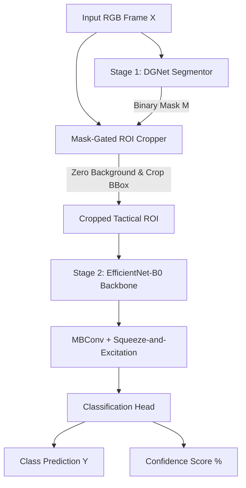

# Stage 2: Tactical Mask-Gated Target Classifier

## Aim & Objective
The Stage 2 Target Classifier takes the spatial region of interest identified by Stage 1 ([DGNet](https://github.com/Gouravbirwaz/Camouflage-Object-Detection-for-Tactical-Military-Surveillance-COD-/blob/dev_yakshith_dev/src/models/dgnet.py)) and categorizes the masked tactical entity (e.g., Personnel, Vehicles, Decoys). 

By isolating the target from surrounding foliage and terrain noise via mask-gating, the classifier achieves high categorical accuracy on subtle, camouflaged features without spending compute on background elements.

---

## Architectural Approach & Data Flow

---

## Technical Explanation & Mathematical Formulation

### 1. Mask-Gated ROI Extraction

To zero out background clutter (foliage, terrain, ambient noise), the full RGB frame undergoes element-wise Hadamard multiplication with the predicted segmentor mask $M_{\text{DGNet}}$:

$$X_{\text{Gated}} = X_{\text{RGB}} \odot M_{\text{DGNet}}$$

Contour bounding box extraction then identifies spatial coordinates $(x_{\min}, y_{\min}, w, h)$ around the non-zero region to crop the tactical patch:

$$\text{ROI} = \text{Crop}(X_{\text{Gated}}, x_{\min}, y_{\min}, w, h) \quad \longrightarrow \quad \text{Resize to } 224 \times 224$$

### 2. Output Formulation

The cropped tensor $\text{ROI} \in \mathbb{R}^{3 \times 224 \times 224}$ passes into the classification network to yield target probabilities:

$$\hat{y} = \text{Softmax}(W \cdot \phi(\text{ROI}) + b)$$

Where:

* $\phi(\text{ROI})$ represents the feature embedding extracted by the backbone.
* $\hat{y}$ is the probability vector over the target classes.

---

## Why EfficientNet-B0 for Classification?

1. **Compound Scaling ($\alpha, \beta, \gamma$):** Uniformly balances network depth, width, and input resolution. This enables maximum feature extraction capability on small, tightly cropped target regions.
2. **Channel-Wise Attention (SE Blocks):** Squeeze-and-Excitation modules recalibrate channel weights to highlight fine-grained tactical indicators (e.g., metallic reflections, weapon outlines) against organic surroundings.
3. **Optimized Edge Footprint:** At **~5.3M parameters** and **~0.39 GFLOPs**, EfficientNet-B0 fits strictly within low-latency RAM budgets alongside Stage 1 on TFLite and edge runtime engines.

